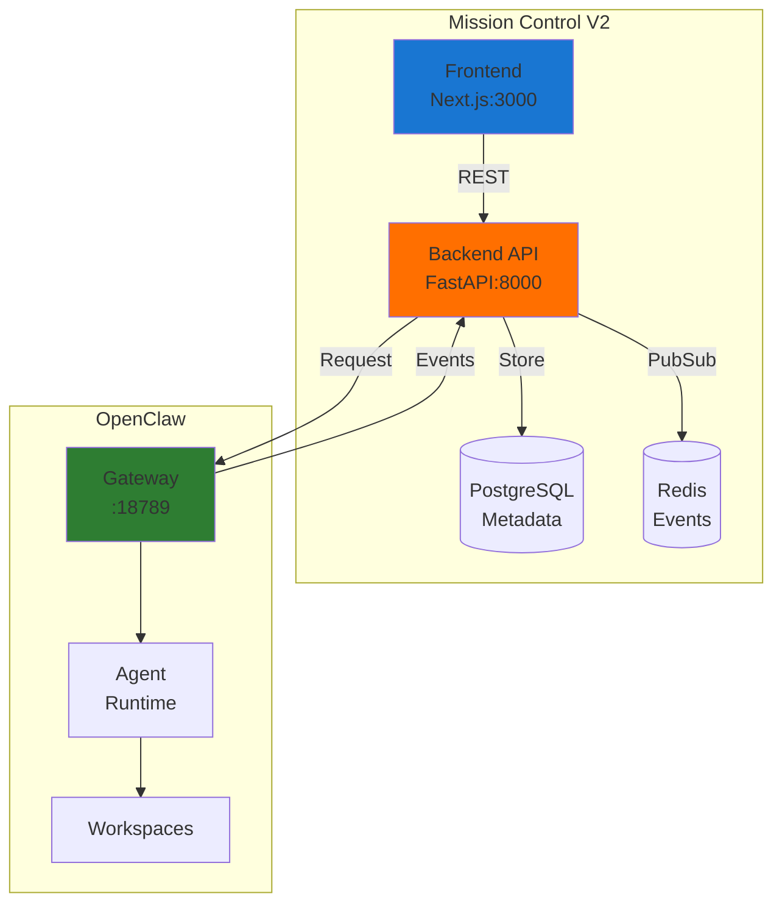

# Mission Control 🎯

> **OpenClaw-native metadata and coordination layer - V2 Production Ready**

## Overview

Mission Control provides a metadata and visualization layer for OpenClaw agents while maintaining strict separation of concerns. OpenClaw owns runtime execution; Mission Control owns metadata and coordination.

## 🚀 Quick Start

```bash
# Clone repository
git clone https://github.com/yourusername/mission-control.git
cd mission-control

# Start Frontend (V1 Dashboard)
npm install
npm run dev
# Visit http://localhost:3000

# Start Backend (V2 API)
cd backend
python3 -m venv venv
source venv/bin/activate
pip install -r requirements.txt
python main_test.py
# Visit http://localhost:8001/docs
```

## Architecture Evolution

### V1: Read-Only Dashboard ✅
- Visualization of OpenClaw agents
- Static configuration
- WebSocket monitoring
- **Status: Complete**

### V2: Metadata & Coordination ✅
- FastAPI backend with PostgreSQL
- Task → Job → Session model
- SSE event streaming
- OpenClaw adapter pattern
- **Status: Complete**

### V3: Enterprise Features 🚧
- Multi-cluster support
- Approval workflows
- Resource provisioning
- Advanced orchestration
- **Status: In Progress**

## System Architecture



## Core Principles

1. **OpenClaw Native**: Mission Control NEVER becomes a custom runtime
2. **Reference-Based**: Store references to OpenClaw objects, not the objects
3. **Request-Only**: Mission Control requests, OpenClaw executes
4. **Event-Driven**: React to OpenClaw events, don't control them

## Features

### Current (V2)
- ✅ Agent metadata management
- ✅ Task and job tracking
- ✅ Real-time event streaming (SSE)
- ✅ RESTful API with OpenAPI docs
- ✅ PostgreSQL for metadata storage
- ✅ Redis for event pub/sub
- ✅ Docker Compose setup
- ✅ Cloud-ready architecture

### Coming (V3)
- 🚧 Approval workflows
- 🚧 Artifact management
- 🚧 Multi-cluster support
- 🚧 Resource provisioning
- 🚧 Advanced monitoring

## Project Structure

```
mission-control/
├── frontend/          # Next.js dashboard (V1)
├── backend/           # FastAPI server (V2)
│   ├── api/          # REST endpoints
│   ├── models/       # Database models
│   ├── services/     # Business logic
│   └── main.py       # Application entry
├── docs/             # Documentation
├── infra/            # Infrastructure configs
└── docker-compose.yml
```

## API Documentation

### Interactive Docs
Visit http://localhost:8000/docs for Swagger UI

### Key Endpoints
- `GET /health` - Health check
- `GET /api/v1/agents` - List agents
- `POST /api/v1/tasks` - Create task
- `GET /api/v1/stream` - SSE events

## Deployment

### Local Development
```bash
# Using Docker Compose
docker-compose up -d

# Or run individually
npm run dev           # Frontend
python backend/main.py # Backend
```

### Google Cloud Platform
```bash
# Deploy to Cloud Run
gcloud run deploy mission-control-backend --source backend
gcloud run deploy mission-control-frontend --source frontend
```

See [Infrastructure Guide](infra/README.md) for detailed deployment instructions.

## Configuration

### Backend (.env)
```env
DATABASE_URL=postgresql://localhost:5432/mission_control
REDIS_URL=redis://localhost:6379
OPENCLAW_GATEWAY_URL=ws://127.0.0.1:18789
```

### Frontend
```env
NEXT_PUBLIC_API_URL=http://localhost:8000
```

## Testing

```bash
# Backend tests
cd backend
python test_api.py

# Frontend
npm test
```

## Documentation

- [Setup Guide](docs/SETUP_GUIDE.md) - Complete installation instructions
- [OpenClaw Bridge](docs/OPENCLAW_BRIDGE.md) - Integration specification
- [Infrastructure](infra/README.md) - Deployment and operations

## Contributing

1. Fork the repository
2. Create feature branch
3. Commit changes
4. Push to branch
5. Open Pull Request

## License

MIT License - See LICENSE file

## Support

- Issues: https://github.com/yourusername/mission-control/issues
- Documentation: /docs
- OpenClaw: https://openclaw.ai