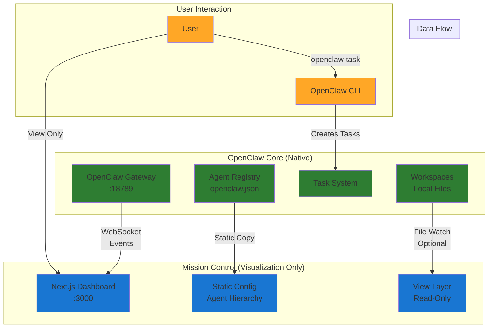
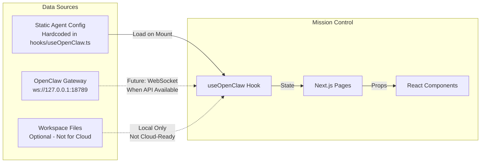
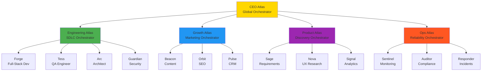

# Mission Control 🎯

> **A pure visualization and management dashboard for OpenClaw agents - 100% OpenClaw native, zero custom engine**

## 🎯 Mission Statement

Mission Control is a **read-only dashboard** that visualizes and monitors your OpenClaw agent ecosystem. We strictly adhere to OpenClaw's native architecture:

- **NO custom task routing** - OpenClaw handles all routing
- **NO agent management logic** - OpenClaw manages agents
- **NO task creation engine** - OpenClaw creates and assigns tasks
- **ONLY visualization and monitoring** - We display what OpenClaw is already doing

## 🏗️ Architecture Overview



## 🚀 What Mission Control Does

### ✅ DOES (Visualization & Monitoring)
- **Displays** agent hierarchy and organization structure
- **Shows** task status and distribution across agents
- **Monitors** agent workload and activity
- **Visualizes** the multi-agent ecosystem
- **Provides** quick OpenClaw CLI command references
- **Tracks** system health and metrics

### ❌ DOES NOT (Remains OpenClaw Native)
- Create or route tasks (use `openclaw task`)
- Manage agent lifecycle (use `openclaw agent`)
- Store task data (OpenClaw uses filesystem)
- Implement custom routing logic
- Replace any OpenClaw functionality

## 🛠️ Implementation Approach

### Current Implementation


### Cloud-Ready Architecture
- **No file system dependencies** - Works without local file access
- **Static configuration** - Agent structure embedded for reliability
- **Gateway-ready** - Prepared for OpenClaw WebSocket API when available
- **Stateless** - No database, no persistent storage
- **Read-only** - Never modifies OpenClaw state

## 📁 Project Structure

```
mission-control/
├── app/                      # Next.js 14 App Router
│   ├── agents/              # Agent listing page
│   │   └── [id]/           # Individual agent detail pages
│   ├── hierarchy/          # Organization structure view
│   ├── kanban/            # Task board visualization
│   └── monitoring/        # System health dashboard
├── components/             # React components
│   └── AgentMonitor.tsx  # Agent status component
├── hooks/                  # Custom React hooks
│   ├── useOpenClaw.ts    # Main OpenClaw integration
│   └── useAgentData.ts   # Agent data management
└── server/                # Server utilities (optional)
    └── watcher.js        # File watcher (local only)
```

## 🚦 Getting Started

### Prerequisites
- Node.js 22+
- OpenClaw installed and configured
- OpenClaw gateway running (`openclaw gateway`)

### Installation
```bash
# Clone the repository
git clone https://github.com/durdan/mission-control.git
cd mission-control

# Install dependencies
npm install

# Start development server
npm run dev
```

### Environment Setup
No environment variables needed! Mission Control uses:
- OpenClaw gateway on `127.0.0.1:18789` (default)
- Static agent configuration (embedded)

## 🎮 Usage

### Viewing Agents
Navigate to `http://localhost:3000` to see:
- Agent hierarchy visualization
- Current task assignments
- Agent status and workload

### Creating Tasks
Mission Control **does not create tasks**. Use OpenClaw CLI:
```bash
# Assign task to specific agent
openclaw task "Build feature X" --agent forge

# Let OpenClaw route automatically
openclaw task "Analyze security requirements"
```

### Monitoring
- `/agents` - View all agents and their status
- `/agents/[id]` - Detailed view of specific agent
- `/hierarchy` - Organization structure
- `/kanban` - Task board view
- `/monitoring` - System health metrics

## 🏗️ Technical Decisions

### Why Static Configuration?
```javascript
// hooks/useOpenClaw.ts
const staticAgents = [
  {
    id: 'ceo',
    name: 'CEO Atlas',
    workspace: '/Users/durdan/orchestrators/ceo-atlas',
    model: 'openrouter/anthropic/claude-sonnet-4.5'
  },
  // ... more agents
];
```
- **Always available** - Works even if OpenClaw is offline
- **Fast loading** - No API calls needed
- **Cloud-ready** - No file system access required
- **Reliable** - Matches actual OpenClaw configuration

### Why No Custom Engine?
- **OpenClaw is the engine** - We don't reinvent what already works
- **Single source of truth** - OpenClaw manages all agent logic
- **Maintainability** - Less code to maintain
- **Compatibility** - Always works with OpenClaw updates

## 📊 Agent Organization Example



## 🔄 Future Enhancements

### When OpenClaw WebSocket API is Available
- [ ] Real-time task updates via WebSocket
- [ ] Live agent status changes
- [ ] Dynamic agent discovery
- [ ] Task completion notifications

### Maintaining OpenClaw Native Approach
- [ ] Never add task creation to UI
- [ ] Never implement custom routing
- [ ] Always defer to OpenClaw for logic
- [ ] Keep as read-only dashboard

## 🤝 Contributing

When contributing, please maintain our core principles:
1. **Stay OpenClaw native** - Don't add custom engines
2. **Read-only focus** - Visualization and monitoring only
3. **Cloud-ready** - No local file dependencies
4. **Static when possible** - Reduce API dependencies

## 📝 License

MIT License - See LICENSE file for details

## 🙏 Acknowledgments

- Built for [OpenClaw](https://openclaw.ai) agent orchestration
- Uses Next.js 14 with App Router
- Tailwind CSS for styling
- React Icons for UI elements

---

**Remember**: Mission Control is a window into your OpenClaw system, not a control panel. All agent management and task routing happens through OpenClaw's native tools. We visualize, we don't customize!

🦞 **Keep it native, keep it simple, keep it OpenClaw!**
