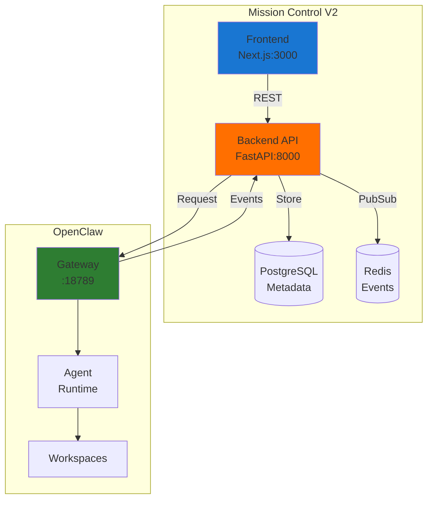

# Mission Control 🎯

> **Real-time Dashboard for OpenClaw Agent Sessions - V3 Production Ready**

## Overview

Mission Control provides a modern, real-time dashboard for monitoring and managing OpenClaw agent sessions. It offers full visibility into your AI agent ecosystem with live session tracking, token usage monitoring, and gateway enrollment management.

**🚀 V3 Production Ready** - Fully integrated with OpenClaw CLI for independent operation.

## ✨ Key Features

### 🎯 Real-Time Session Monitoring
- **Live Session Tracking**: View all active OpenClaw sessions with automatic updates
- **Token Usage Display**: Monitor token consumption (e.g., "33k/164k - 20.18%")
- **Model Information**: See which AI models each agent is using
- **Session Metadata**: Age, type, status, and unique identifiers

### 🔌 OpenClaw Bridge API  
- **Independent Architecture**: Works with OpenClaw anywhere (local/remote)
- **CLI Integration**: Translates OpenClaw CLI commands to REST APIs
- **WebSocket Updates**: Real-time updates every 5 seconds
- **No File Dependency**: Uses OpenClaw CLI, not direct file access

### 🔑 Token Management
- **Gateway Enrollment UI**: Update OpenClaw tokens from the dashboard
- **Secure Entry**: Password-protected token input
- **Auto-Reconnection**: Seamless reconnection after token updates
- **Help Integration**: Built-in command reference

### 🔄 Demo Mode Toggle (NEW)
- **Live/Demo Data Switch**: Toggle between real OpenClaw data and demo data
- **Visual Indicators**: Orange "DEMO MODE" badge for demo, green indicator for live
- **Persistent Preference**: Saves your choice in localStorage
- **Clear Data Labels**: "📊 DEMO:" prefix for demo, "🦞 LIVE:" for real data
- **Graceful Fallback**: Shows demo data when OpenClaw is unavailable

## 🚀 Quick Start

```bash
# Prerequisites
# - Node.js 18+ and npm installed
# - Python 3.8+ for V3 backend
# - OpenClaw CLI installed and configured
# - OpenClaw gateway running (openclaw gateway status)

# Clone and install
git clone https://github.com/yourusername/mission-control.git
cd mission-control
npm install

# Start the dashboard (Terminal 1)
npm run dev

# Start the Bridge API (Terminal 2)  
node server/openclaw-bridge.js

# For V3 Enterprise Features (Terminal 3)
cd backend
python3 -m venv venv
venv/bin/pip install -r requirements.txt
venv/bin/python main_dev.py  # Development mode with SQLite

# Access the dashboard
# Main: http://localhost:3000
# V3 Enterprise: http://localhost:3000/v3
```

## 🏗️ Architecture

```
┌─────────────────┐     ┌──────────────────┐     ┌─────────────────┐
│   Next.js UI    │────▶│  Bridge API      │────▶│  OpenClaw CLI   │
│  (Port 3000)    │◀────│  (Port 3001)     │◀────│   (Gateway)     │
└─────────────────┘     └──────────────────┘     └─────────────────┘
         │                       │
         │                       │
         ▼                       ▼
    WebSocket               REST API
   (Port 3002)             Endpoints
```

### Components
- **Next.js Dashboard**: Modern React UI with real-time updates
- **Bridge API**: Node.js server that wraps OpenClaw CLI commands
- **WebSocket Server**: Pushes live session updates to the UI
- **OpenClaw Integration**: Works with any OpenClaw instance via CLI
- Resource provisioning system
- RBAC security model
- Real-time metrics and monitoring
- **Status: Complete**

## System Architecture



## Core Principles

1. **OpenClaw Native**: Mission Control NEVER becomes a custom runtime
2. **Reference-Based**: Store references to OpenClaw objects, not the objects
3. **Request-Only**: Mission Control requests, OpenClaw executes
4. **Event-Driven**: React to OpenClaw events, don't control them

## Features

### Current (V2)
- ✅ Agent metadata management
- ✅ Task and job tracking
- ✅ Real-time event streaming (SSE)
- ✅ RESTful API with OpenAPI docs
- ✅ PostgreSQL for metadata storage
- ✅ Redis for event pub/sub
- ✅ Docker Compose setup
- ✅ Cloud-ready architecture

### V3 Enterprise Features (Complete)
- ✅ Multi-cluster management with load balancing
- ✅ Advanced approval workflows with escalation
- ✅ Resource provisioning (compute, storage, network)
- ✅ RBAC with JWT authentication
- ✅ Real-time metrics collection and alerting
- ✅ Time-series data aggregation
- ✅ Workflow engine for complex approvals

## Project Structure

```
mission-control/
├── app/              # Next.js app directory
│   └── v3/          # V3 dashboard
├── components/       # React components
│   └── v3/          # V3 components
├── backend/          # FastAPI server
│   ├── api/         # REST endpoints
│   │   ├── v1/     # V1/V2 endpoints
│   │   └── v3/     # V3 enterprise endpoints
│   ├── models/      # Database models
│   │   ├── models.py    # V2 models
│   │   └── v3_models.py # V3 models
│   ├── services/    # Business logic
│   │   ├── cluster_manager.py
│   │   ├── workflow_engine.py
│   │   ├── resource_provisioner.py
│   │   ├── rbac_manager.py
│   │   └── metrics_collector.py
│   └── main.py      # Application entry
├── docs/            # Documentation
├── infra/           # Infrastructure configs
└── docker-compose.yml
```

## API Documentation

### Interactive Docs
Visit http://localhost:8000/docs for Swagger UI

### Key Endpoints

#### V1/V2 API
- `GET /health` - Health check
- `GET /api/v1/agents` - List agents
- `POST /api/v1/tasks` - Create task
- `GET /api/v1/stream` - SSE events

#### V3 API (Enterprise)
- `GET /api/v3/` - V3 API information
- **Clusters**
  - `POST /api/v3/clusters` - Register cluster
  - `GET /api/v3/clusters` - List clusters
  - `POST /api/v3/clusters/distribute` - Distribute task
- **Resources**
  - `POST /api/v3/resources/provision` - Provision resources
  - `GET /api/v3/resources/quotas` - Get quotas
- **RBAC**
  - `POST /api/v3/rbac/roles` - Create role
  - `POST /api/v3/rbac/assignments` - Assign role
  - `POST /api/v3/rbac/tokens` - Create access token
- **Metrics**
  - `POST /api/v3/metrics/record` - Record metric
  - `GET /api/v3/metrics/dashboard` - Dashboard metrics
  - `GET /api/v3/metrics/alerts/active` - Active alerts

## Deployment

### Local Development
```bash
# Frontend with Bridge API
npm run dev                        # Next.js on port 3000
node server/openclaw-bridge.js     # Bridge API on port 3001

# V3 Backend (Development mode)
cd backend
venv/bin/python main_dev.py        # FastAPI on port 8001
# Uses SQLite and in-memory storage - no PostgreSQL/Redis needed!

# V3 Backend (Production mode) 
docker-compose up -d                # Full stack with PostgreSQL & Redis
```

### Demo Mode
The dashboard includes a demo/live toggle in the top-right corner:
- **Demo Mode**: Shows sample data for testing and exploration
- **Live Mode**: Connects to real OpenClaw sessions
- Toggle persists across sessions
- Automatic fallback to demo when OpenClaw is unavailable

### Google Cloud Platform
```bash
# Deploy to Cloud Run
gcloud run deploy mission-control-backend --source backend
gcloud run deploy mission-control-frontend --source frontend
```

See [Infrastructure Guide](infra/README.md) for detailed deployment instructions.

## Configuration

### Backend (.env)
```env
DATABASE_URL=postgresql://localhost:5432/mission_control
REDIS_URL=redis://localhost:6379
OPENCLAW_GATEWAY_URL=ws://127.0.0.1:18789
```

### Frontend
```env
NEXT_PUBLIC_API_URL=http://localhost:8000
```

## Testing

```bash
# Backend tests
cd backend
python test_api.py

# Frontend
npm test
```

## Documentation

- [Setup Guide](docs/SETUP_GUIDE.md) - Complete installation instructions
- [OpenClaw Bridge](docs/OPENCLAW_BRIDGE.md) - Integration specification
- [Infrastructure](infra/README.md) - Deployment and operations

## Contributing

1. Fork the repository
2. Create feature branch
3. Commit changes
4. Push to branch
5. Open Pull Request

## License

MIT License - See LICENSE file

## Support

- Issues: https://github.com/yourusername/mission-control/issues
- Documentation: /docs
- OpenClaw: https://openclaw.ai