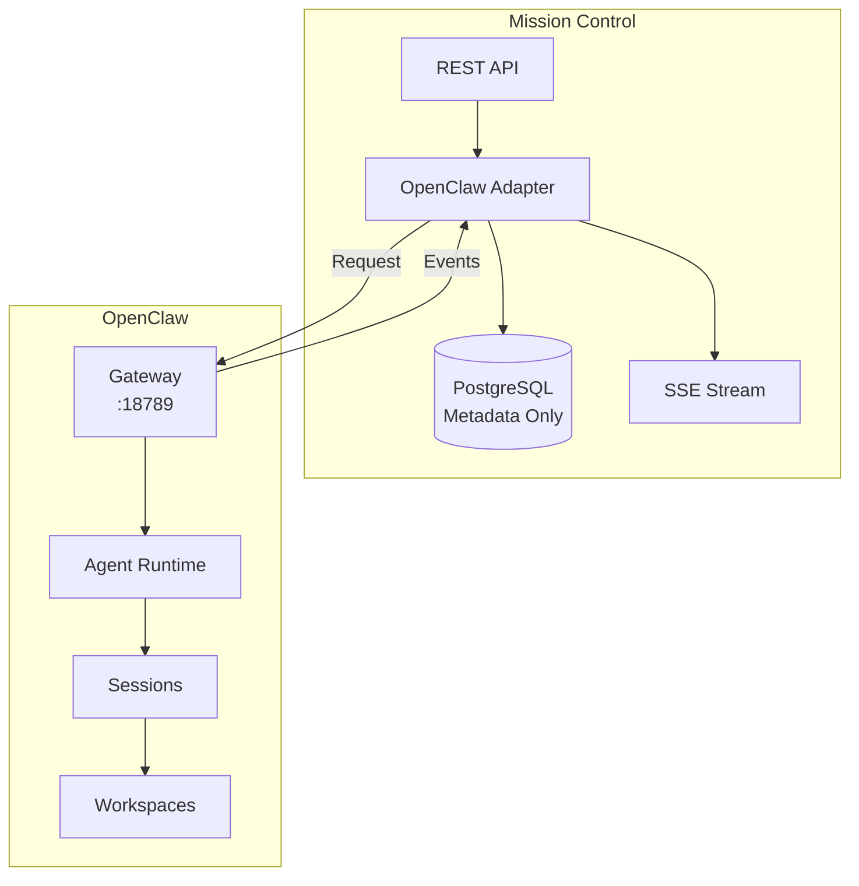
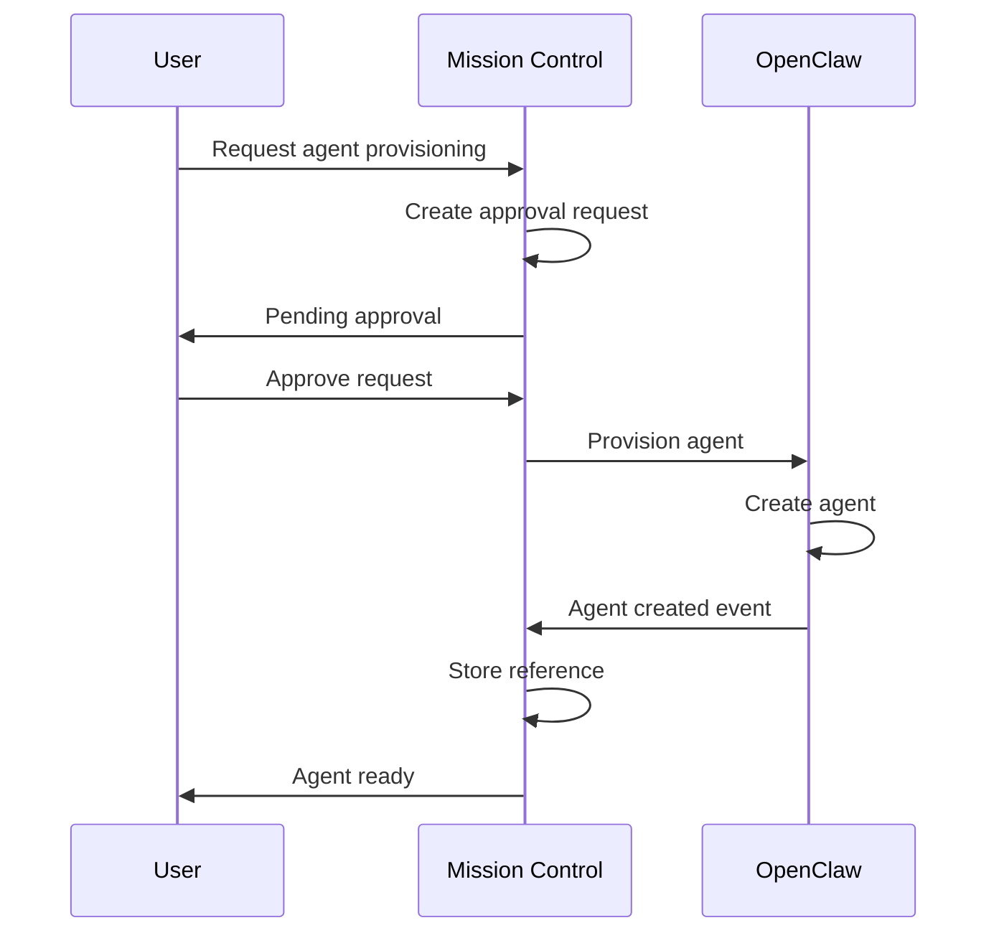

# OpenClaw Bridge Specification

## Overview

This document defines the interface between Mission Control and OpenClaw. Mission Control acts as a metadata and coordination layer, while OpenClaw owns all runtime execution.

## Core Principles

1. **OpenClaw Native**: Mission Control NEVER becomes a custom runtime
2. **Reference-Based**: We store references to OpenClaw objects, not the objects themselves
3. **Request-Only**: Mission Control requests actions, OpenClaw executes them
4. **Event-Driven**: OpenClaw pushes events, Mission Control reacts

## Architecture



## Communication Protocol

### WebSocket Connection

Mission Control connects to OpenClaw Gateway via WebSocket:

```javascript
ws://127.0.0.1:18789
```

#### Authentication
```json
{
  "type": "auth",
  "token": "OPENCLAW_TOKEN"
}
```

### Message Types

#### From Mission Control → OpenClaw (Requests)

##### 1. Create Agent Request
```json
{
  "type": "create_agent",
  "request_id": "req_123",
  "spec": {
    "id": "agent_001",
    "name": "Data Processor",
    "model": "gpt-4",
    "role": "processor",
    "prompt": "You are a data processor..."
  }
}
```

##### 2. Start Session Request
```json
{
  "type": "start_session",
  "request_id": "req_124",
  "agent_ref": "oclaw_agent_001",
  "job_id": "job_456",
  "task": {
    "description": "Process CSV data",
    "context": {...}
  }
}
```

##### 3. End Session Request
```json
{
  "type": "end_session",
  "request_id": "req_125",
  "session_ref": "oclaw_session_789"
}
```

##### 4. Provision Resource Request
```json
{
  "type": "provision_resource",
  "request_id": "req_126",
  "resource_type": "agent",
  "spec": {...},
  "approval_id": "approval_001"
}
```

#### From OpenClaw → Mission Control (Events)

##### 1. Agent Status Event
```json
{
  "type": "agent_status",
  "agent_ref": "oclaw_agent_001",
  "status": "active",
  "timestamp": "2024-01-15T10:30:00Z",
  "metrics": {
    "memory_usage": 256,
    "active_sessions": 1
  }
}
```

##### 2. Session Update Event
```json
{
  "type": "session_update",
  "session_ref": "oclaw_session_789",
  "job_id": "job_456",
  "status": "running",
  "progress": 45,
  "current_step": "Processing row 450 of 1000"
}
```

##### 3. Session Completed Event
```json
{
  "type": "session_completed",
  "session_ref": "oclaw_session_789",
  "job_id": "job_456",
  "status": "success",
  "output": {...},
  "artifacts": [
    {
      "id": "artifact_001",
      "path": "/workspace/output.csv",
      "type": "file",
      "size": 1024000
    }
  ]
}
```

##### 4. Heartbeat Event
```json
{
  "type": "heartbeat",
  "agent_ref": "oclaw_agent_001",
  "timestamp": "2024-01-15T10:30:00Z",
  "state": "idle"
}
```

##### 5. Error Event
```json
{
  "type": "error",
  "source_ref": "oclaw_session_789",
  "error_code": "EXEC_FAILED",
  "message": "Failed to execute task",
  "details": {...}
}
```

## Database References

Mission Control stores only references to OpenClaw objects:

```sql
-- Agent table
CREATE TABLE agents (
    id VARCHAR PRIMARY KEY,           -- Our ID
    openclaw_agent_ref VARCHAR,        -- OpenClaw's agent ID
    openclaw_session_ref VARCHAR,      -- Current session if any
    workspace_path VARCHAR,            -- Path to workspace (read-only)
    -- ... metadata fields
);

-- Job table  
CREATE TABLE jobs (
    id VARCHAR PRIMARY KEY,
    openclaw_session_ref VARCHAR,      -- OpenClaw session reference
    -- ... metadata fields
);
```

## REST API Endpoints

Mission Control exposes REST APIs that internally communicate with OpenClaw:

### Agent Management
- `POST /api/v1/agents` - Request agent creation
- `GET /api/v1/agents/{id}` - Get agent metadata + live status
- `POST /api/v1/agents/{id}/register` - Register existing OpenClaw agent

### Job Management
- `POST /api/v1/jobs` - Create job (starts OpenClaw session)
- `POST /api/v1/jobs/{id}/cancel` - Request session cancellation
- `GET /api/v1/jobs/{id}` - Get job status

### Events
- `GET /api/v1/stream` - SSE stream of OpenClaw events

## Approval Workflow

For sensitive operations, Mission Control implements approval before requesting OpenClaw:



## Error Handling

Mission Control handles OpenClaw errors gracefully:

1. **Connection Lost**: Attempt reconnection with exponential backoff
2. **Request Timeout**: Mark request as failed, notify user
3. **Invalid Reference**: Sync with OpenClaw to update references
4. **Execution Error**: Log error, update job status, emit event

## Security Considerations

1. **Token-Based Auth**: Use secure token for OpenClaw Gateway
2. **Reference Validation**: Always validate references exist in OpenClaw
3. **Read-Only Workspaces**: Never modify OpenClaw workspace files
4. **Event Verification**: Verify event sources before processing

## Implementation Notes

### OpenClawAdapter Service

The adapter service (`backend/services/openclaw_adapter.py`) implements this protocol:

```python
class OpenClawAdapter:
    async def create_agent(spec) -> dict:
        """Request OpenClaw to create agent, return reference"""
        
    async def start_session(agent_ref, job_id, task) -> dict:
        """Request session start, return session reference"""
        
    async def receive_event(event) -> None:
        """Process incoming OpenClaw event"""
```

### Event Flow

1. OpenClaw sends event via WebSocket
2. OpenClawAdapter receives and processes event
3. Event stored in database (if significant)
4. Event published to Redis for SSE subscribers
5. Frontend receives event via SSE stream

## Testing

### Mock OpenClaw Gateway

For development, create a mock gateway that simulates OpenClaw:

```python
# tests/mock_openclaw.py
class MockOpenClawGateway:
    async def handle_request(self, request):
        if request["type"] == "create_agent":
            return {
                "type": "agent_created",
                "openclaw_agent_ref": f"mock_agent_{request['spec']['id']}"
            }
```

### Integration Tests

Test the full flow from API request to OpenClaw communication:

```python
async def test_create_agent_flow():
    # 1. API request to create agent
    # 2. Verify OpenClaw request sent
    # 3. Simulate OpenClaw response
    # 4. Verify reference stored
    # 5. Verify event emitted
```

## Migration Strategy

For existing OpenClaw deployments:

1. **Discovery**: Query OpenClaw for existing agents
2. **Registration**: Register each agent in Mission Control
3. **Reference Mapping**: Store OpenClaw references
4. **Validation**: Verify all references are valid
5. **Monitoring**: Start receiving events

## Future Enhancements

### V3 Features
- Multi-cluster OpenClaw support
- Advanced provisioning workflows
- Resource quotas and limits
- Cross-agent orchestration

### Protocol Extensions
- Binary artifact streaming
- Batch operations
- Priority queues
- Resource scheduling

## Appendix: Message Schemas

Full JSON schemas for all message types are available in:
- `/docs/schemas/openclaw-requests.json`
- `/docs/schemas/openclaw-events.json`