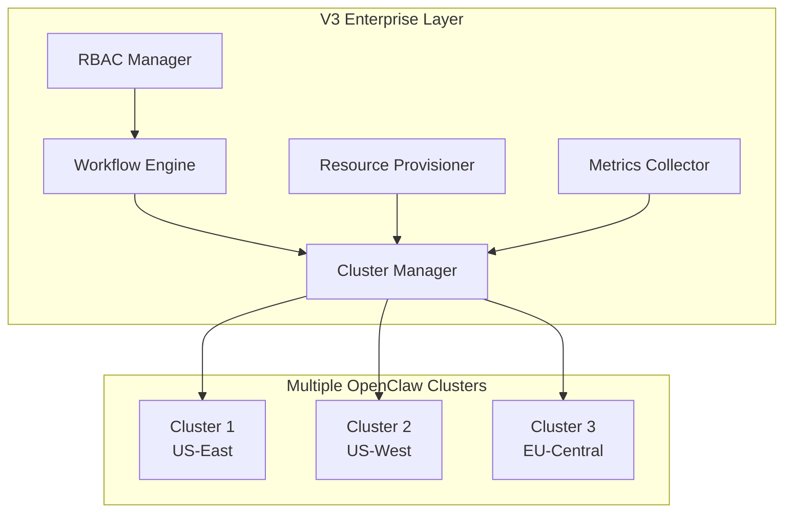

# Mission Control V3 Enterprise Features

## Overview

Mission Control V3 introduces enterprise-grade features for managing OpenClaw at scale while maintaining strict OpenClaw-native boundaries.

## Architecture



## Features

### 1. Multi-Cluster Management

Manage multiple OpenClaw clusters with intelligent load balancing and automatic failover.

**Key Capabilities:**
- Register and monitor multiple clusters
- Health checks and heartbeat monitoring
- Automatic failover on cluster failure
- Load distribution strategies:
  - Round-robin
  - Least-loaded
  - Geo-nearest
  - Cost-optimized
  - Performance-optimized

**API Example:**
```python
# Register a cluster
POST /api/v3/clusters
{
  "name": "production-us-east",
  "gateway_url": "http://cluster1.openclaw.com",
  "region": "us-east",
  "max_agents": 100
}

# Distribute task to optimal cluster
POST /api/v3/clusters/distribute
{
  "task_id": "task-123",
  "requirements": {"region": "us-east"},
  "strategy": "least_loaded"
}
```

### 2. Advanced Workflow Engine

Create complex approval workflows with conditional routing and automatic escalation.

**Features:**
- Multi-level approvals
- Conditional branching
- Automatic escalation
- SLA tracking
- Parallel and sequential flows

**Workflow Template Example:**
```json
{
  "name": "Resource Provisioning Approval",
  "steps": [
    {
      "type": "approval",
      "approvers": ["team-lead"],
      "timeout": 3600,
      "escalation": ["manager"]
    },
    {
      "type": "conditional",
      "condition": "cost > 1000",
      "true_branch": "finance-approval",
      "false_branch": "auto-approve"
    }
  ]
}
```

### 3. Resource Provisioning

Manage infrastructure resources with multiple provisioning strategies.

**Provisioning Strategies:**
- **Immediate**: Provision resources instantly
- **Scheduled**: Schedule for future provisioning
- **On-Demand**: Provision when triggered
- **Pre-Warmed**: Use pre-warmed resource pools
- **Spot**: Use spot/preemptible instances

**Resource Types:**
- Compute (CPU, memory, accelerators)
- Storage (disk, IOPS)
- Network (bandwidth, IPs, load balancers)

**API Example:**
```python
# Provision resources
POST /api/v3/resources/provision
{
  "name": "ml-training-cluster",
  "compute": {
    "vcpus": 16,
    "memory_gb": 64,
    "accelerators": ["gpu-v100"]
  },
  "storage": {
    "disk_gb": 500,
    "disk_type": "pd-ssd"
  },
  "strategy": "immediate"
}
```

### 4. RBAC Security

Enterprise-grade role-based access control with JWT authentication.

**Default Roles:**
- **Administrator**: Full system access
- **Operator**: Manage agents and tasks
- **Developer**: Create workflows
- **Viewer**: Read-only access
- **Approver**: Approve requests
- **Auditor**: View audit logs

**Permission Model:**
```
resource_type:scope
Examples:
- agent:write
- cluster:admin
- workflow:execute
- *:read (read all resources)
```

**API Example:**
```python
# Create custom role
POST /api/v3/rbac/roles
{
  "name": "DevOps Engineer",
  "description": "Manage clusters and resources",
  "permissions": [
    "cluster:write",
    "resource:write",
    "metric:read"
  ]
}

# Assign role to user
POST /api/v3/rbac/assignments
{
  "user_id": "user-123",
  "role_id": "devops-engineer"
}
```

### 5. Metrics & Monitoring

Real-time metrics collection with alerting and time-series analysis.

**Metric Categories:**
- Performance (latency, throughput)
- Reliability (success rate, error rate)
- Capacity (utilization, availability)
- Cost (hourly, monthly)
- Health (status, uptime)

**Alert Thresholds:**
```python
# Set alert threshold
POST /api/v3/metrics/alerts/thresholds
{
  "metric_name": "cluster.utilization",
  "max_value": 90,
  "sustained_duration": 300
}
```

**Time-Series Aggregation:**
- Sum, Average, Min, Max
- Percentiles (P50, P95, P99)
- Count
- Multiple intervals (1m, 5m, 15m, 1h, 1d)

## Usage Examples

### Example 1: Multi-Cluster Task Distribution

```python
import requests

# Get optimal cluster for task
response = requests.get(
    "http://localhost:8001/api/v3/clusters/optimal",
    params={
        "strategy": "least_loaded",
        "region": "us-east",
        "min_capacity": 5
    }
)

cluster = response.json()
print(f"Selected cluster: {cluster['name']} ({cluster['utilization']}% utilized)")
```

### Example 2: Resource Provisioning with Approval

```python
# Create provisioning request
provision_request = {
    "name": "data-processing-cluster",
    "compute": {"vcpus": 32, "memory_gb": 128},
    "storage": {"disk_gb": 1000}
}

# Estimate cost
cost = requests.post(
    "http://localhost:8001/api/v3/resources/estimate",
    json=provision_request
).json()

print(f"Estimated cost: ${cost['monthly_cost']}/month")

# Provision with approval workflow
if cost['monthly_cost'] > 500:
    # Trigger approval workflow
    workflow = requests.post(
        "http://localhost:8001/api/v3/workflows/start",
        json={
            "template": "high-cost-approval",
            "context": provision_request
        }
    ).json()
```

### Example 3: Metrics Dashboard Integration

```javascript
// React component for metrics
const MetricsDashboard = () => {
  const [metrics, setMetrics] = useState(null);
  
  useEffect(() => {
    const fetchMetrics = async () => {
      const response = await fetch('/api/v3/metrics/dashboard');
      const data = await response.json();
      setMetrics(data);
    };
    
    fetchMetrics();
    const interval = setInterval(fetchMetrics, 10000);
    return () => clearInterval(interval);
  }, []);
  
  return (
    <div>
      <h2>System Metrics</h2>
      <div>CPU Usage: {metrics?.summary.cpu_usage}%</div>
      <div>Active Agents: {metrics?.summary.agents_active}</div>
      <div>Success Rate: {metrics?.summary.success_rate}%</div>
    </div>
  );
};
```

## Configuration

### Environment Variables

```env
# V3 Features
ENABLE_MULTI_CLUSTER=true
ENABLE_WORKFLOWS=true
ENABLE_RBAC=true
ENABLE_METRICS=true

# Cluster Configuration
MAX_CLUSTERS=10
FAILOVER_TIMEOUT=300
HEALTH_CHECK_INTERVAL=30

# Resource Limits
MAX_VCPUS_PER_REQUEST=64
MAX_MEMORY_GB_PER_REQUEST=256
MAX_STORAGE_GB_PER_REQUEST=10000

# RBAC
JWT_SECRET_KEY=your-secret-key
TOKEN_EXPIRY=3600

# Metrics
METRICS_RETENTION_DAYS=30
AGGREGATION_INTERVAL=60
```

## Migration from V2 to V3

1. **Database Migration:**
   ```bash
   alembic upgrade head
   ```

2. **Update Configuration:**
   - Add V3 environment variables
   - Configure JWT secret key
   - Set resource quotas

3. **Register Clusters:**
   ```python
   # Register existing OpenClaw instance
   POST /api/v3/clusters
   {
     "name": "primary",
     "gateway_url": "http://localhost:18789"
   }
   ```

4. **Create Roles:**
   - Default roles are created automatically
   - Add custom roles as needed

5. **Enable Metrics:**
   - Metrics collection starts automatically
   - Configure alert thresholds

## Security Considerations

1. **Authentication:**
   - JWT tokens for API access
   - Token refresh mechanism
   - Secure token storage

2. **Authorization:**
   - Fine-grained permissions
   - Resource-level access control
   - Audit logging

3. **Network Security:**
   - TLS for cluster communication
   - API rate limiting
   - CORS configuration

4. **Data Protection:**
   - Encrypted storage for sensitive data
   - Secure credential management
   - Regular security audits

## Performance Optimization

1. **Caching:**
   - Redis for frequently accessed data
   - Metric aggregation caching
   - Cluster status caching

2. **Async Operations:**
   - Background task processing
   - Event-driven architecture
   - WebSocket for real-time updates

3. **Database Optimization:**
   - Indexed queries
   - Connection pooling
   - Query optimization

## Monitoring & Observability

1. **Metrics:**
   - Application metrics
   - Infrastructure metrics
   - Business metrics

2. **Logging:**
   - Structured logging
   - Log aggregation
   - Error tracking

3. **Tracing:**
   - Distributed tracing
   - Request correlation
   - Performance profiling

## Troubleshooting

### Common Issues

1. **Cluster Connection Failed:**
   - Check gateway URL
   - Verify network connectivity
   - Check authentication

2. **High Resource Utilization:**
   - Review metrics dashboard
   - Check for resource leaks
   - Scale resources if needed

3. **Approval Workflow Stuck:**
   - Check workflow status
   - Verify approver availability
   - Check escalation rules

4. **Metrics Not Updating:**
   - Verify metrics collector running
   - Check Redis connection
   - Review aggregation settings

## Best Practices

1. **Cluster Management:**
   - Regular health checks
   - Capacity planning
   - Disaster recovery plan

2. **Resource Management:**
   - Set appropriate quotas
   - Monitor utilization
   - Cost optimization

3. **Security:**
   - Regular role audits
   - Token rotation
   - Principle of least privilege

4. **Monitoring:**
   - Set meaningful alerts
   - Regular metric review
   - Capacity trending

## Future Enhancements

- GraphQL API support
- Machine learning-based scaling
- Advanced cost optimization
- Kubernetes operator
- Multi-cloud support
- Compliance reporting
- Advanced analytics