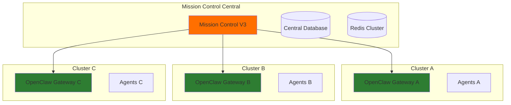
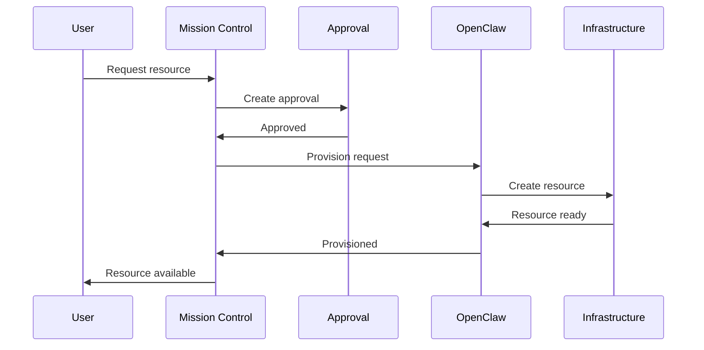
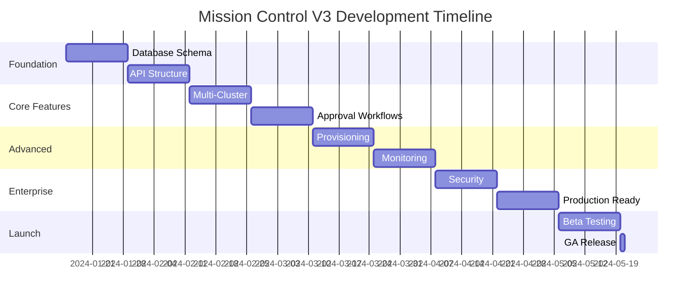

# Mission Control V3 Roadmap

## Executive Summary

Mission Control V3 represents the enterprise-ready evolution of our OpenClaw metadata and coordination layer. This version focuses on multi-cluster support, advanced workflows, and production-grade reliability while maintaining strict OpenClaw-native boundaries.

## V3 Core Features

### 1. Multi-Cluster Support

#### Architecture


#### Implementation
- Cluster registry and discovery
- Load balancing across clusters
- Failover and health monitoring
- Cross-cluster task distribution

### 2. Advanced Approval Workflows

#### Features
- Multi-level approval chains
- Conditional approval routing
- Time-based escalations
- Approval templates
- Audit trail

#### Workflow Example
```yaml
approval_workflow:
  name: "Production Deployment"
  steps:
    - level: 1
      approvers: ["team_lead"]
      timeout: 2h
      escalate_to: "manager"
    - level: 2
      approvers: ["security_team"]
      parallel: true
      required: 2
    - level: 3
      approvers: ["cto"]
      condition: "cost > $10000"
```

### 3. Resource Provisioning

#### Supported Resources
- Agent provisioning
- Workspace allocation
- Compute resources
- Storage volumes
- Network configurations

#### Provisioning Pipeline


### 4. Advanced Monitoring & Observability

#### Metrics Collection
- Agent performance metrics
- Task execution analytics
- Resource utilization
- Cost tracking
- SLA monitoring

#### Dashboard Features
- Real-time metrics visualization
- Custom dashboards
- Alert configuration
- Report generation
- Trend analysis

### 5. Enterprise Security

#### Security Features
- RBAC (Role-Based Access Control)
- SSO integration (SAML/OIDC)
- API key management
- Audit logging
- Encryption at rest and in transit

#### Access Control Model
```yaml
roles:
  admin:
    permissions: ["*"]
  operator:
    permissions: ["read:*", "execute:tasks", "manage:agents"]
  viewer:
    permissions: ["read:*"]
  developer:
    permissions: ["read:*", "execute:dev_tasks"]
```

## Implementation Plan

### Phase 1: Foundation (Weeks 1-4)

#### Database Schema Updates
```sql
-- Multi-cluster support
CREATE TABLE clusters (
    id UUID PRIMARY KEY,
    name VARCHAR(255) UNIQUE NOT NULL,
    gateway_url VARCHAR(255) NOT NULL,
    region VARCHAR(100),
    status VARCHAR(50),
    health_check_url VARCHAR(255),
    last_heartbeat TIMESTAMP
);

-- Enhanced approvals
CREATE TABLE approval_workflows (
    id UUID PRIMARY KEY,
    name VARCHAR(255) NOT NULL,
    template JSON NOT NULL,
    created_by VARCHAR(255),
    is_active BOOLEAN DEFAULT true
);

-- Resource provisioning
CREATE TABLE provisioning_requests (
    id UUID PRIMARY KEY,
    resource_type VARCHAR(100) NOT NULL,
    cluster_id UUID REFERENCES clusters(id),
    specifications JSON NOT NULL,
    status VARCHAR(50),
    provisioned_resource_id VARCHAR(255),
    cost_estimate DECIMAL(10,2)
);

-- RBAC
CREATE TABLE roles (
    id UUID PRIMARY KEY,
    name VARCHAR(100) UNIQUE NOT NULL,
    permissions JSON NOT NULL
);

CREATE TABLE user_roles (
    user_id VARCHAR(255),
    role_id UUID REFERENCES roles(id),
    granted_at TIMESTAMP DEFAULT NOW(),
    granted_by VARCHAR(255),
    PRIMARY KEY (user_id, role_id)
);
```

### Phase 2: Core Features (Weeks 5-8)

#### Multi-Cluster Manager
```python
class ClusterManager:
    async def register_cluster(self, cluster_spec: dict):
        """Register new OpenClaw cluster"""
        
    async def get_optimal_cluster(self, requirements: dict):
        """Select best cluster for task"""
        
    async def distribute_task(self, task: Task, strategy: str):
        """Distribute task across clusters"""
        
    async def monitor_health(self):
        """Health check all clusters"""
```

#### Approval Engine
```python
class ApprovalEngine:
    async def create_workflow(self, template: dict):
        """Create approval workflow"""
        
    async def process_approval(self, request_id: str, decision: str):
        """Process approval decision"""
        
    async def check_escalations(self):
        """Check for timeout escalations"""
        
    async def get_pending_approvals(self, approver: str):
        """Get approvals for user"""
```

### Phase 3: Advanced Features (Weeks 9-12)

#### Resource Provisioner
```python
class ResourceProvisioner:
    async def provision_agent(self, spec: AgentSpec):
        """Provision new agent"""
        
    async def allocate_resources(self, requirements: dict):
        """Allocate compute/storage"""
        
    async def estimate_cost(self, resource_spec: dict):
        """Estimate provisioning cost"""
        
    async def cleanup_resources(self, resource_id: str):
        """Cleanup unused resources"""
```

#### Monitoring Service
```python
class MonitoringService:
    async def collect_metrics(self):
        """Collect metrics from all sources"""
        
    async def calculate_sla(self, service: str):
        """Calculate SLA compliance"""
        
    async def generate_report(self, report_type: str):
        """Generate analytics report"""
        
    async def predict_capacity(self):
        """ML-based capacity prediction"""
```

### Phase 4: Enterprise Features (Weeks 13-16)

#### Security Implementation
- SAML/OIDC integration
- API key rotation
- Audit log streaming
- Compliance reporting

#### Production Readiness
- Performance optimization
- Load testing
- Disaster recovery
- Documentation

## API Endpoints (V3)

### Cluster Management
```
POST   /api/v3/clusters                 - Register cluster
GET    /api/v3/clusters                 - List clusters
GET    /api/v3/clusters/{id}/health     - Cluster health
POST   /api/v3/clusters/{id}/drain      - Drain cluster
DELETE /api/v3/clusters/{id}            - Remove cluster
```

### Workflow Management
```
POST   /api/v3/workflows                - Create workflow
GET    /api/v3/workflows/{id}           - Get workflow
PUT    /api/v3/workflows/{id}           - Update workflow
POST   /api/v3/workflows/{id}/execute   - Execute workflow
GET    /api/v3/workflows/{id}/status    - Workflow status
```

### Resource Provisioning
```
POST   /api/v3/provision                - Request provisioning
GET    /api/v3/provision/{id}           - Get provision status
POST   /api/v3/provision/{id}/approve   - Approve provisioning
DELETE /api/v3/provision/{id}           - Cancel provisioning
GET    /api/v3/resources                - List resources
```

### Advanced Monitoring
```
GET    /api/v3/metrics                  - Get metrics
GET    /api/v3/metrics/agents           - Agent metrics
GET    /api/v3/metrics/tasks            - Task metrics
GET    /api/v3/analytics/reports        - List reports
POST   /api/v3/analytics/generate       - Generate report
GET    /api/v3/sla/{service}            - SLA status
```

### Security & Access
```
POST   /api/v3/auth/login               - SSO login
POST   /api/v3/auth/logout              - Logout
GET    /api/v3/auth/user                - Current user
POST   /api/v3/roles                    - Create role
PUT    /api/v3/roles/{id}               - Update role
POST   /api/v3/users/{id}/roles         - Assign role
GET    /api/v3/audit                    - Audit logs
```

## Performance Targets

### Scalability
- Support 1000+ concurrent agents
- Handle 10,000+ tasks/hour
- Manage 50+ OpenClaw clusters
- 100,000+ events/minute

### Reliability
- 99.9% uptime SLA
- < 100ms API response time (p95)
- Zero data loss guarantee
- Automatic failover < 30 seconds

### Efficiency
- 70% reduction in manual approvals
- 50% faster task distribution
- 80% resource utilization
- 40% cost optimization

## Migration Strategy

### From V2 to V3
1. **Database Migration**
   - Add new tables without disrupting V2
   - Migrate data in batches
   - Maintain backward compatibility

2. **API Versioning**
   - Run V2 and V3 endpoints in parallel
   - Gradual client migration
   - Deprecation notices

3. **Feature Rollout**
   - Feature flags for new capabilities
   - Staged rollout by team/cluster
   - Rollback procedures

## Testing Strategy

### Test Coverage
- Unit tests: 80% coverage
- Integration tests: All API endpoints
- Performance tests: Load and stress testing
- Security tests: Penetration testing

### Test Environments
```yaml
environments:
  development:
    clusters: 1
    agents: 10
    database: PostgreSQL (local)
    
  staging:
    clusters: 3
    agents: 50
    database: Cloud SQL
    
  production:
    clusters: 10+
    agents: 1000+
    database: Cloud SQL HA
```

## Success Metrics

### Technical Metrics
- API latency < 100ms (p95)
- Error rate < 0.1%
- Cluster failover < 30s
- Data consistency 100%

### Business Metrics
- 50% reduction in operational overhead
- 75% faster time-to-deployment
- 90% user satisfaction score
- 40% cost reduction

## Timeline



## Risks & Mitigations

### Technical Risks
1. **Multi-cluster complexity**
   - Mitigation: Start with 2-cluster support, scale gradually
   
2. **Performance at scale**
   - Mitigation: Implement caching, optimize queries
   
3. **Security vulnerabilities**
   - Mitigation: Regular security audits, penetration testing

### Business Risks
1. **User adoption**
   - Mitigation: Comprehensive training, documentation
   
2. **Migration complexity**
   - Mitigation: Backward compatibility, staged rollout
   
3. **Cost overrun**
   - Mitigation: Cloud cost monitoring, resource optimization

## Conclusion

Mission Control V3 represents a significant leap forward in enterprise agent orchestration while maintaining our commitment to OpenClaw-native architecture. By focusing on multi-cluster support, advanced workflows, and enterprise features, V3 will enable organizations to scale their agent operations efficiently and securely.

The phased approach ensures we can deliver value incrementally while maintaining system stability. With proper execution, V3 will establish Mission Control as the definitive metadata and coordination layer for OpenClaw deployments at scale.